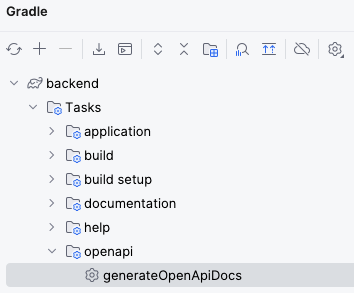

# Swagger-UI

<details open="open">
<summary>目次</summary>

- [OpenAPIのドキュメント作成](#OpenAPIのドキュメント作成)
  - [初期設定](#初期設定)
  - [使い方](#使い方)
- [OpenAPIのドキュメントからFrontendの型を自動生成](#OpenAPIのドキュメントからFrontendの型を自動生成)
  - [初期設定](#初期設定)
  - [使い方](#使い方)
</details>

# OpenAPIのドキュメント作成

### 初期設定

<details>
<summary> gradle.ktsに追記</summary>

- pluginの方は、ドキュメントを作成するためのプラグイン
- 依存関係はswaggerが使えるようにするためのもの

```kotlin
 plugins {
    id("org.springdoc.openapi-gradle-plugin") version "1.8.0"
}
dependencies {
    implementation("org.springdoc:springdoc-openapi-starter-webmvc-ui:2.5.0")
}
```

</details>

<details>
<summary> application.ymlに追記</summary>

- production環境ではSwaggerが見えないように。セキュリティー的に危険

```application.yml
springdoc:
  swagger-ui:
    enable:true
```

</details>

### 使い方

<details>
<summary> 1.GUIへアクセス</summary>

- 下記エンドポイントをブラウザで叩く(springが自動生成)

```zh
 http://localhost:8080/swagger-ui/index.html
```

</details>

<details>
<summary> 2.Gradle画面でドキュメント作成</summary>

- 下記のgenerateOpenApiDocsをダブルクリックするとタスクが実行されてbuildファイルに入る



```zh
 http://localhost:8080/swagger-ui/index.html
```

</details>

# OpenAPIのドキュメントからFrontendの型を自動生成

### 初期設定
<details>
<summary> gradle.ktsに追記</summary>

- generatorNameはopenAPIのドキュメントに指定されている文字列と完全一致が必要（参考）

```kotlin
plugins {
  id("org.openapi.generator") version "7.4.0"
}
tasks.register("openApiGeneratorAll"){
  dependsOn(
    "openApiGeneratorForSwift",
    "openApiGeneratorForTypescript",
  )
}

tasks.register<GenerateTask>("openApiGeneratorForSwift") {
  generatorName = "swift5"
  inputSpec = project.layout.buildDirectory.dir("openapi.json").get().asFile.path
  outputDir = project.layout.buildDirectory.dir("openapi/swift/OpenApIClient").get().asFile.path
}

tasks.register<GenerateTask>("openApiGeneratorForTypescript") {
  generatorName = "typescript-axios"
  inputSpec = project.layout.buildDirectory.dir("openapi.json").get().asFile.path
  outputDir = project.layout.buildDirectory.dir("openapi/typescript/OpenApIClient").get().asFile.path
}
```

</details>


### 使い方

<details>
<summary> Gradle画面でTaskを実行</summary>

- 上記に追加したTaskを実行すると自動生成される
- Typescript-axiosだと、api.tsに型定義ファイルが入る

</details>

# 参考

- [Qiita記事](https://qiita.com/m_masashi/items/61700164e8aaa35481b3)
- [OpenAPIジェネレータ](https://openapi-generator.tech/docs/generators/)
